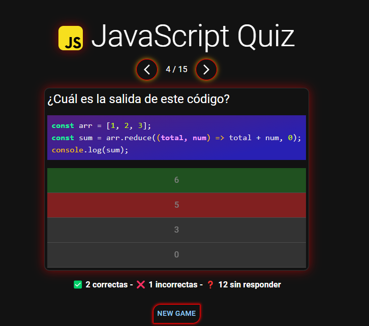

# JavaScript Quiz

Ein interaktives Quiz, um Ihr Wissen über JavaScript zu testen.

## Über das Projekt

Dieses Projekt ist ein interaktives Quiz, das verschiedene Fragen zu JavaScript enthält. Es wurde entwickelt, um Benutzern zu helfen, ihr Wissen über JavaScript zu testen und zu verbessern.

## Verwendete Technologien

- React
- TypeScript
- Zustand (für die Zustandverwaltung)
- Material-UI (für die Benutzeroberfläche)
- Vite (für das Build-Tool)
- ESLint (für die Code-Qualität)

## Installation

1. Klonen Sie das Repository:
   ```sh
   git clone https://github.com/your-username/javascriptQuiz.git

cd javascriptQuiz

npm install

npm run dev

## Projektstruktur
.github/
  workflows/
    jekyll-gh-pages.yml
.gitignore
eslint.config.js
index.html
package.json
public/
  data.json
README.md
src/
  App.css
  App.tsx
  assets/
    Footer.tsx
    Game.tsx
  hooks/
    useQuestionData.ts
  index.css
  JavaScriptLogo.tsx
  main.tsx
  Start.tsx
  Store/
    questions.ts
  types.d.ts
  vite-env.d.ts
tsconfig.app.json
tsconfig.json
tsconfig.node.json
vite.config.ts

